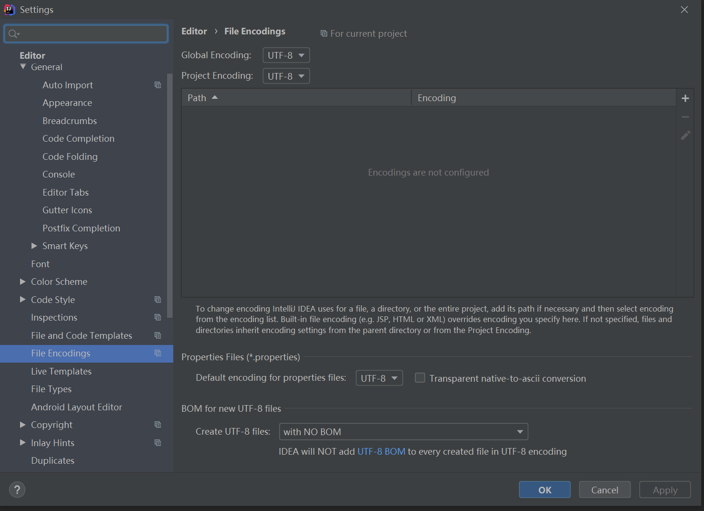

# spring

## 参考文档

https://www.jianshu.com/p/210e8e1b5b53

* IOC

  控制反转，

  人话：提需求，找代理，代理帮你搞需求

* AOP

  面向截面

  人话：设计好边界，面向边界写

* spring mvc

  自带mvc?

* springboot

  1. 注解会给使用者提供方便
  2. 对第三方技术进行了很好的封装和整合，提供了大量第三方接口
  3. 可以通过依赖自动配置，不需要XML等配置文件
  4. 提供了安全等特性

* spring cloud

  springcloud是微服务解决方案，非常方便，是基于springboot的。

## 开始搞idea 了

搞了字符集, 用 u8

## spring boot hello world 

参考文档

https://www.jianshu.com/p/68d8a202c38b

module 里选 spring initializr maven 一顿抽拉会建一个spring boot 的项目

核心的文件： pom.xml 

​                        application.properties/application.yml

​						Application.java (项目的入口文件)

​                        controller 文件夹（与application 同级）

## 感觉vue 要学起来

