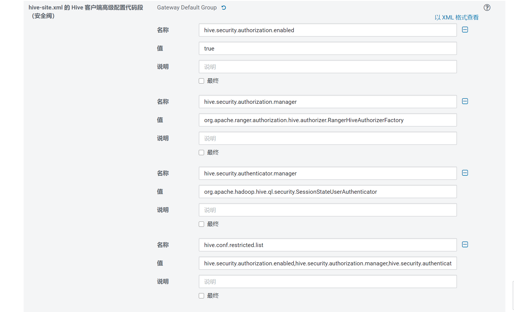
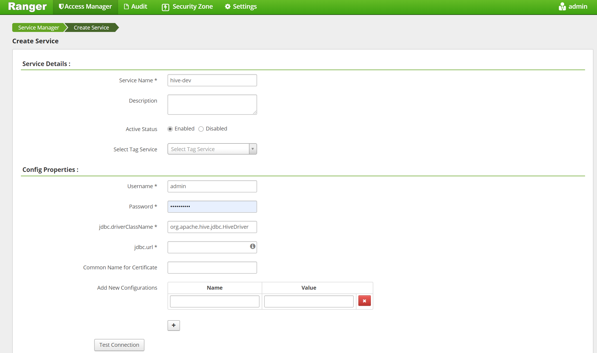

# ranger编译和安装

腾讯课堂 视频（1.2.0）

https://ke.qq.com/webcourse/index.html#cid=443147&term_id=100529499&taid=3859066770604811&type=1024&vid=5285890793895524135


## 下载

下载 ranger

目前版本 2.0.0 

下载渠道，

https://dist.apache.org/repos/dist/release/ranger/2.0.0/

下了release 稳定版，没有像大部分人从 gitlhub 直接下载源码。


## 编译


### 准备工作

```shell
cd /d/wsl/setup
 tar -xvf apache-ranger-2.0.0.tar.gz 

## 直接把名字改了，有时间建议建软连接
mv apache-ranger-2.0.0 ranger

```

查看 我有maven

```shell
mq5445@DESKTOP-7IL9SC5:/d/wsl/setup/ranger$ mvn --version
Apache Maven 3.6.0
Maven home: /usr/share/maven
Java version: 1.8.0_241, vendor: Oracle Corporation, runtime: /mnt/d/wsl/setup/java/jre
Default locale: en, platform encoding: UTF-8
OS name: "linux", version: "4.4.0-18362-microsoft", arch: "amd64", family: "unix"

```

根据cdh 版本改 pom

https://docs.cloudera.com/documentation/enterprise/6/release-notes/topics/rg_cdh_63_packaging.html


CDH 6.3.2

| **Component**    | **Component Version** |
| :--------------- | :-------------------- |
| Apache Avro      | 1.8.2                 |
| Apache Flume     | 1.9.0                 |
| Apache Hadoop    | 3.0.0                 |
| Apache HBase     | 2.1.4                 |
| HBase Indexer    | 1.5                   |
| Apache Hive      | 2.1.1                 |
| Hue              | 4.4.0                 |
| Apache Impala    | 3.2.0                 |
| Apache Kafka     | 2.2.1                 |
| Kite SDK         | 1.0.0                 |
| Apache Kudu      | 1.10.0                |
| Apache Solr      | 7.4.0                 |
| Apache Oozie     | 5.1.0                 |
| Apache Parquet   | 1.9.0                 |
| Parquet-format   | 2.4.0                 |
| Apache Pig       | 0.17.0                |
| Apache Sentry    | 2.1.0                 |
| Apache Spark     | 2.4.0                 |
| Apache Sqoop     | 1.4.7                 |
| Apache ZooKeeper | 3.4.5                 |


对应修改 pom 我改了以下这些

```xml
<hadoop.version>3.0.0</hadoop.version>
<hive.version>2.1.1</hive.version>   <!-- 这个会跟hadoop版本冲突 后面会说怎么做 -->
<kafka.version>2.2.1</kafka.version>
<zookeeper.version>3.4.5</zookeeper.version>

<tomcat.embed.version>7.0.105</tomcat.embed.version> <!-- 这个低于这个版本由安全漏洞 -->

```

hbase 的版本有问题，改下面的会报错。
所以没改保留了 hbase 2.0.2去编译，也有人和我一样这里会报错, 下面的不要按cdh的改。会有问题


```xml
    <hbase.version>2.1.4</hbase.version>
    <hbase-shaded-protobuf>2.1.4</hbase-shaded-protobuf>
    <hbase-shaded-netty>2.1.4</hbase-shaded-netty>
    <hbase-shaded-miscellaneous>2.1.4</hbase-shaded-miscellaneous>

<sqoop.version>1.4.7</sqoop.version>

```


### 编译


开始编译

```shell

mvn clean compile package assembly:assembly -Dpmd.skip=true  install -DskipTests -Drat.skip=true
```

这里 跳过了 pmd 静态代码检测。加上会报错。特别蛋疼。搞了2天这个。


看有的人说要装 git 和 python

我的都有

python 版本 

```she
mq5445@DESKTOP-7IL9SC5:~$ python --version
Python 2.7.17
```

```shell
Downloaded from alimaven: http://maven.aliyun.com/nexus/content/groups/public/net/minidev/json-smart/maven-metadata.xml (850 B at 435 B/s)
```

这里补充添加了 osc 的源，ali 的似乎没有jboss

```shell
sudo vim /etc/maven/settings.xml
```


找到 mirrors位置里添加

```xml

<mirror>
        <id>osc</id>
        <mirrorOf>*</mirrorOf>
        <url>http://maven.oschina.net/content/groups/public/</url>
    </mirror>

```


hbase 版本报错。看有的老哥也这报错。

查了下

hive-agent 报错，默认是3.1.2 

改2.1.1 有问题


查了下 ranger 0.7 版本才支持2.1.1 这个版本。

cdh 的这个hive版本太老了

编译完了。用不起来。

大佬的做法。

https://blog.csdn.net/tomalun/article/details/105490214


下了个 ranger 1.2.0 把对应的 hive-agent 覆盖掉 ranger 2.0.0 的 hive-agent 


第10次编译后

```shell
[INFO] ------------------------------------------------------------------------
[INFO] Reactor Summary:
[INFO] 
[INFO] ranger 2.0.0 ....................................... SUCCESS [  0.714 s]
[INFO] Jdbc SQL Connector 2.0.0 ........................... SUCCESS [  0.362 s]
[INFO] Credential Support 2.0.0 ........................... SUCCESS [  1.299 s]
[INFO] Audit Component 2.0.0 .............................. SUCCESS [  1.586 s]
[INFO] Common library for Plugins 2.0.0 ................... SUCCESS [  2.552 s]
[INFO] Installer Support Component 2.0.0 .................. SUCCESS [  0.253 s]
[INFO] Credential Builder 2.0.0 ........................... SUCCESS [  1.004 s]
[INFO] Embedded Web Server Invoker 2.0.0 .................. SUCCESS [  1.253 s]
[INFO] Key Management Service 2.0.0 ....................... SUCCESS [  1.781 s]
[INFO] ranger-plugin-classloader 2.0.0 .................... SUCCESS [  0.310 s]
[INFO] HBase Security Plugin Shim 2.0.0 ................... SUCCESS [  2.004 s]
[INFO] HBase Security Plugin 2.0.0 ........................ SUCCESS [  2.483 s]
[INFO] Hdfs Security Plugin 2.0.0 ......................... SUCCESS [  1.517 s]
[INFO] Hive Security Plugin 1.2.0 ......................... SUCCESS [  2.599 s]
[INFO] Knox Security Plugin Shim 2.0.0 .................... SUCCESS [  1.584 s]
[INFO] Knox Security Plugin 2.0.0 ......................... SUCCESS [  2.815 s]
[INFO] Storm Security Plugin 2.0.0 ........................ SUCCESS [  1.566 s]
[INFO] YARN Security Plugin 2.0.0 ......................... SUCCESS [  1.439 s]
[INFO] Ozone Security Plugin 2.0.0 ........................ SUCCESS [  1.794 s]
[INFO] Ranger Util 2.0.0 .................................. SUCCESS [  3.815 s]
[INFO] Unix Authentication Client 2.0.0 ................... SUCCESS [  0.760 s]
[INFO] Security Admin Web Application 2.0.0 ............... SUCCESS [01:05 min]
[INFO] KAFKA Security Plugin 2.0.0 ........................ SUCCESS [  1.394 s]
[INFO] SOLR Security Plugin 2.0.0 ......................... SUCCESS [  3.854 s]
[INFO] NiFi Security Plugin 2.0.0 ......................... SUCCESS [  1.214 s]
[INFO] NiFi Registry Security Plugin 2.0.0 ................ SUCCESS [  1.188 s]
[INFO] Unix User Group Synchronizer 2.0.0 ................. SUCCESS [  1.736 s]
[INFO] Ldap Config Check Tool 2.0.0 ....................... SUCCESS [  0.456 s]
[INFO] Unix Authentication Service 2.0.0 .................. SUCCESS [  1.300 s]
[INFO] KMS Security Plugin 2.0.0 .......................... SUCCESS [  1.463 s]
[INFO] Tag Synchronizer 2.0.0 ............................. SUCCESS [  1.631 s]
[INFO] Hdfs Security Plugin Shim 2.0.0 .................... SUCCESS [  1.128 s]
[INFO] Hive Security Plugin Shim 2.0.0 .................... SUCCESS [  3.083 s]
[INFO] YARN Security Plugin Shim 2.0.0 .................... SUCCESS [  1.496 s]
[INFO] OZONE Security Plugin Shim 2.0.0 ................... SUCCESS [  1.766 s]
[INFO] Storm Security Plugin shim 2.0.0 ................... SUCCESS [  1.422 s]
[INFO] KAFKA Security Plugin Shim 2.0.0 ................... SUCCESS [  1.164 s]
[INFO] SOLR Security Plugin Shim 2.0.0 .................... SUCCESS [  1.994 s]
[INFO] Atlas Security Plugin Shim 2.0.0 ................... SUCCESS [  1.349 s]
[INFO] KMS Security Plugin Shim 2.0.0 ..................... SUCCESS [  1.464 s]
[INFO] ranger-examples 2.0.0 .............................. SUCCESS [  0.113 s]
[INFO] Ranger Examples - Conditions and ContextEnrichers 2.0.0 SUCCESS [  1.155 s]
[INFO] Ranger Examples - SampleApp 2.0.0 .................. SUCCESS [  0.264 s]
[INFO] Ranger Examples - Ranger Plugin for SampleApp 2.0.0  SUCCESS [  1.239 s]
[INFO] Ranger Tools 2.0.0 ................................. SUCCESS [  1.179 s]
[INFO] Atlas Security Plugin 2.0.0 ........................ SUCCESS [  1.484 s]
[INFO] Sqoop Security Plugin 2.0.0 ........................ SUCCESS [  1.313 s]
[INFO] Sqoop Security Plugin Shim 2.0.0 ................... SUCCESS [  1.196 s]
[INFO] Kylin Security Plugin 2.0.0 ........................ SUCCESS [  1.507 s]
[INFO] Kylin Security Plugin Shim 2.0.0 ................... SUCCESS [  1.401 s]
[INFO] Elasticsearch Security Plugin Shim 2.0.0 ........... SUCCESS [  0.454 s]
[INFO] Elasticsearch Security Plugin 2.0.0 ................ SUCCESS [  1.295 s]
[INFO] Presto Security Plugin 2.0.0 ....................... SUCCESS [  1.310 s]
[INFO] Presto Security Plugin Shim 2.0.0 .................. SUCCESS [  1.307 s]
[INFO] Unix Native Authenticator 2.0.0 .................... SUCCESS [  0.695 s]
[INFO] ------------------------------------------------------------------------
[INFO] BUILD SUCCESS
[INFO] ------------------------------------------------------------------------
[INFO] Total time:  42:43 min
[INFO] Finished at: 2020-07-22T10:12:59+08:00
[INFO] ------------------------------------------------------------------------

```

结果：

```shell
root@DESKTOP-7IL9SC5:/mnt/d/wsl/setup/ranger# ll target/
total 1534276
drwxr-xr-x 1 root   root        4096 Jul 22 10:10 ./
drwxrwxr-x 1 mq5445 mq5445      4096 Jul 22 09:30 ../
-rw-r--r-- 1 root   root          30 Jul 22 10:10 .plxarc
drwxr-xr-x 1 root   root        4096 Jul 22 09:30 antrun/
drwxr-xr-x 1 root   root        4096 Jul 22 10:09 archive-tmp/
drwxr-xr-x 1 root   root        4096 Jul 22 09:30 maven-shared-archive-resources/
-rw-r--r-- 1 root   root   215913533 Jul 22 10:01 ranger-2.0.0-admin.tar.gz
-rw-r--r-- 1 root   root   217022494 Jul 22 10:03 ranger-2.0.0-admin.zip
-rw-r--r-- 1 root   root    27540587 Jul 22 10:06 ranger-2.0.0-atlas-plugin.tar.gz
-rw-r--r-- 1 root   root    27570212 Jul 22 10:06 ranger-2.0.0-atlas-plugin.zip
-rw-r--r-- 1 root   root    30983732 Jul 22 10:09 ranger-2.0.0-elasticsearch-plugin.tar.gz
-rw-r--r-- 1 root   root    31019906 Jul 22 10:09 ranger-2.0.0-elasticsearch-plugin.zip
-rw-r--r-- 1 root   root    26575282 Jul 22 09:53 ranger-2.0.0-hbase-plugin.tar.gz
-rw-r--r-- 1 root   root    26594864 Jul 22 09:53 ranger-2.0.0-hbase-plugin.zip
-rw-r--r-- 1 root   root    23709141 Jul 22 09:51 ranger-2.0.0-hdfs-plugin.tar.gz
-rw-r--r-- 1 root   root    23735788 Jul 22 09:51 ranger-2.0.0-hdfs-plugin.zip
-rw-r--r-- 1 root   root    23745317 Jul 22 09:52 ranger-2.0.0-hive-plugin.tar.gz
-rw-r--r-- 1 root   root    23769378 Jul 22 09:53 ranger-2.0.0-hive-plugin.zip
-rw-r--r-- 1 root   root    39811408 Jul 22 09:55 ranger-2.0.0-kafka-plugin.tar.gz
-rw-r--r-- 1 root   root    39847327 Jul 22 09:56 ranger-2.0.0-kafka-plugin.zip
-rw-r--r-- 1 root   root    90070439 Jul 22 10:04 ranger-2.0.0-kms.tar.gz
-rw-r--r-- 1 root   root    90175690 Jul 22 10:05 ranger-2.0.0-kms.zip
-rw-r--r-- 1 root   root    28272440 Jul 22 09:54 ranger-2.0.0-knox-plugin.tar.gz
-rw-r--r-- 1 root   root    28295654 Jul 22 09:54 ranger-2.0.0-knox-plugin.zip
-rw-r--r-- 1 root   root    23684723 Jul 22 10:08 ranger-2.0.0-kylin-plugin.tar.gz
-rw-r--r-- 1 root   root    23718242 Jul 22 10:08 ranger-2.0.0-kylin-plugin.zip
-rw-r--r-- 1 root   root       34256 Jul 22 10:04 ranger-2.0.0-migration-util.tar.gz
-rw-r--r-- 1 root   root       37740 Jul 22 10:04 ranger-2.0.0-migration-util.zip
-rw-r--r-- 1 root   root    26126862 Jul 22 09:57 ranger-2.0.0-ozone-plugin.tar.gz
-rw-r--r-- 1 root   root    26159348 Jul 22 09:57 ranger-2.0.0-ozone-plugin.zip
-rw-r--r-- 1 root   root    39654366 Jul 22 10:10 ranger-2.0.0-presto-plugin.tar.gz
-rw-r--r-- 1 root   root    39691150 Jul 22 10:10 ranger-2.0.0-presto-plugin.zip
-rw-r--r-- 1 root   root    22146467 Jul 22 10:05 ranger-2.0.0-ranger-tools.tar.gz
-rw-r--r-- 1 root   root    22156287 Jul 22 10:05 ranger-2.0.0-ranger-tools.zip
-rw-r--r-- 1 root   root    26905522 Jul 22 09:58 ranger-2.0.0-solr-plugin.tar.gz
-rw-r--r-- 1 root   root    26938293 Jul 22 09:58 ranger-2.0.0-solr-plugin.zip
-rw-r--r-- 1 root   root       42230 Jul 22 10:03 ranger-2.0.0-solr_audit_conf.tar.gz
-rw-r--r-- 1 root   root       45636 Jul 22 10:03 ranger-2.0.0-solr_audit_conf.zip
-rw-r--r-- 1 root   root    23695951 Jul 22 10:07 ranger-2.0.0-sqoop-plugin.tar.gz
-rw-r--r-- 1 root   root    23724222 Jul 22 10:07 ranger-2.0.0-sqoop-plugin.zip
-rw-r--r-- 1 root   root     4071859 Jul 22 10:06 ranger-2.0.0-src.tar.gz
-rw-r--r-- 1 root   root     6340193 Jul 22 10:06 ranger-2.0.0-src.zip
-rw-r--r-- 1 root   root    36938489 Jul 22 09:54 ranger-2.0.0-storm-plugin.tar.gz
-rw-r--r-- 1 root   root    36963193 Jul 22 09:55 ranger-2.0.0-storm-plugin.zip
-rw-r--r-- 1 root   root    33709608 Jul 22 10:04 ranger-2.0.0-tagsync.tar.gz
-rw-r--r-- 1 root   root    33720483 Jul 22 10:04 ranger-2.0.0-tagsync.zip
-rw-r--r-- 1 root   root    16191997 Jul 22 10:03 ranger-2.0.0-usersync.tar.gz
-rw-r--r-- 1 root   root    16208427 Jul 22 10:04 ranger-2.0.0-usersync.zip
-rw-r--r-- 1 root   root    23701001 Jul 22 09:56 ranger-2.0.0-yarn-plugin.tar.gz
-rw-r--r-- 1 root   root    23730557 Jul 22 09:57 ranger-2.0.0-yarn-plugin.zip
-rw-r--r-- 1 root   root           5 Jul 22 10:10 version

```


## 安装Ranger控制台：Ranger-admin


这里又折腾了几个小时，连mysql一直在报错

```shell
tar -zxvf ranger-2.0.0-admin.tar.gz
```

```shell
vim install.properties
```


设置了一大堆 连mysql 的

```shell
db_root_user=root
db_root_password=Bdp@boc01!
db_host=22.188.12.73

db_name=ranger
db_user=ranger
db_password=Bdp@boc01!

rangerAdmin_password=Bdp@boc01!
rangerTagsync_password=Bdp@boc01!
rangerUsersync_password=Bdp@boc01!
keyadmin_password=Bdp@boc01!


#audit_store=db  先没开审计 我自己感觉用处不大
audit_db_name=ranger_audit
audit_db_user=ranger_audit
audit_db_password=Bdp@boc01!

policymgr_http_enabled=true
policymgr_https_keystore_file=
policymgr_https_keystore_keyalias=rangeradmin
policymgr_https_keystore_password=Bdp@boc01!


```


跑起来一直在报如下错误


```shell
2020-07-15 17:26:19,354  [JISQL] /data/app/jdk11/jdk-11.0.5/bin/java  -cp /data/ranger/lib/mysql-connector-java-5.1.38.jar:/data/ranger/target/ranger-2.0.0-admin/jisql/lib/* org.apache.util.sql.Jisql -driver mysqlconj -cstring jdbc:mysql://22.188.12.73/ranger -u 'ranger' -p '********' -noheader -trim -c \;  -query "select 1;"
Wed Jul 15 17:26:20 CST 2020 WARN: Establishing SSL connection without server's identity verification is not recommended. According to MySQL 5.5.45+, 5.6.26+ and 5.7.6+ requirements SSL connection must be established by default if explicit option isn't set. For compliance with existing applications not using SSL the verifyServerCertificate property is set to 'false'. You need either to explicitly disable SSL by setting useSSL=false, or set useSSL=true and provide truststore for server certificate verification.
SQLException : SQL state: 42000 com.mysql.jdbc.exceptions.jdbc4.MySQLSyntaxErrorException: Access denied for user 'ranger'@'22.188.12.73' to database 'ranger' ErrorCode: 1044
2020-07-15 17:26:20,524  [E] Can't establish connection!! Exiting..
2020-07-15 17:26:20,524  [I] Please run DB setup first or contact Administrator..
2020-07-15 17:26:20,540  [E] 'setup_mode' not found in /data/ranger/target/ranger-2.0.0-admin/install.properties file while getting....!!

```


报错大概意思是没有权限

root 登进去，发现root 本身没有本地登陆权限

 没有 /tmp/mysql.sock


查看 /etc/my.cnf

新增对应命令指向对应mysqld 配置的sock

```shell
[clinet]
sock=/ccc/mysql.sock

[mysql]
sock=/ccc/mysql.sock
```


改完发现 root 本地可以进去了，但是还是报上面的错误

看了下报错的位置似乎有区别。网上找了下，是root -h 指定对应ip是 没有grant 权限


```sql
use mysql ;
select * from user where user='root' ;
```

```sql
update user set grant_priv='Y' where User='root' ;
FLUSH PRIVILEGES;
```


初始化 加启动web

```shell
./setup.sh
ews/ranger-admin-services.sh start
```

启动后可以看到 6080 端口的web端


## 安装ranger Usersync

https://blog.csdn.net/andyguan01_2/article/details/88950551

需要使用root用户


Ranger Usersync会将linux系统用户同步到ranger数据库。

**6.1 修改配置文件install.properties**

```
cd /u01/app/ranger-2.0.0/ranger-2.0.0-SNAPSHOT-usersync
vi install.properties
12
```

修改的参数如下：

```
POLICY_MGR_URL=http://10.200.4.117:6080
SYNC_SOURCE=unix
#多久同步一次数据，单位为分钟
SYNC_INTERVAL=1
logdir=/data/ranger/logs/usersync
12345
```

**6.2 执行初始化设置**

执行.：

```
/setup.sh
1
```

**6.3 启动Ranger Usersync**

执行：

```
./ranger-usersync-services.sh start
1
```

ranger-usersync-services.sh的参数如下：

```
[root@oracle02 ranger-2.0.0-SNAPSHOT-usersync]# ./ranger-usersync-services.sh
Invalid argument [];
Usage: Only start | stop | restart | version, are supported.
123
```

验证是否安装成功：打开Ranger控制台页面，点击“Settings->Users/Groups”，可以看到从Linux同步过来的用户信息则说明成功。如下：


## 装hive插件


### 在hive-server2 节点安装hive-plugin

参考文档 （ps:大佬很奔放，格式一团糊 🤮）

https://blog.csdn.net/huangyq5240/article/details/102721679


直接粘的大佬的，目录 6.3.2 对应要换，主要就是 把 ranger-hive-plugin的包放到 cdh 里去

```shell
## 放到对应的cdh目录下去 
cp /home/xxxxxxx/ranger-0.5.4-SNAPSHOT-hive-plugin.tar.gz /opt/cloudera/parcels/CDH/lib

## 软连接或改名字 
 ln -s ranger-0.5.4-SNAPSHOT-hive-plugin ranger-hive-plugin
 
```


```shell
 ## 改配置
 cd ranger-hive-plugin/
 vim install.properties
```


```properties
#对应找到更改
## 必须改
POLICY_MGR_URL=http://172.17.8.94:6080
REPOSITORY_NAME=hivedev

## 审计（我没改）
XAAUDIT.SOLR.ENABLE=true
XAAUDIT.SOLR.URL=http://172.17.8.4:6083/solr/ranger_audits
XAAUDIT.SOLR.FILE_SPOOL_DIR=/var/log/hive/audit/solr/spool

## 改
CUSTOM_USER=hive
CUSTOM_GROUP=hive

```


启动，最终其实是 要重启 hiveserver2 才会生效，所以这里我觉得只是东西分发了下

```shell
#启动插件，感觉其实就是 把东西一顿复制，没具体看
./enable-hive-plugin.sh

## /opt/cloudera/parcels/CDH/lib/ranger-hive-plugin/enable-hive-plugin.sh
```


改cm-agent 对应的分发程序，我感觉是 保证ranger生成的三个配置文件可以同步到对应的 impala ,hivemeta, hiveserver2 等服务上去

```shell
find / -name "cloudera-config.sh" 
## 找个合适的，对应的位置
## 大佬的位置 sudo vim /usr/lib64/cmf/service/common/cloudera-config.sh
vim /opt/cloudera/cm-agent/service/common/cloudera-config.sh
```


```shell
# When created, the final resting place of config files is unknown,
# so it is marked as {{CMF_CONF_DIR}}. We know what this directory will
# be here in this script, so search-replace it.
replace_conf_dir() {
find $CONF_DIR -type f ! -path "$CONF_DIR/logs/*" ! -name "*.log" ! -name "*.keytab" ! -name "*jceks" -exec perl -pi -e "s#{{CMF_CONF_DIR}}#$CONF_DIR#g" {} \;

### 以下为新增,把对应的ranger 的配置同步到 主配置, hive

[[ -e /etc/hive/conf/ranger-hive-audit.xml ]] && {
scp /etc/hive/conf/ranger-hive-audit.xml $CONF_DIR/
scp /etc/hive/conf/ranger-hive-security.xml $CONF_DIR/
scp /etc/hive/conf/ranger-policymgr-ssl.xml $CONF_DIR/ ;
}

### 以下是 yarn 的
[[ -e /etc/hadoop/conf/ranger-yarn-audit.xml ]] && {
scp  /etc/hadoop/conf/ranger-policymgr-ssl.xml     $CONF_DIR/
scp  /etc/hadoop/conf/ranger-security.xml          $CONF_DIR/
scp  /etc/hadoop/conf/ranger-yarn-audit.xml        $CONF_DIR/
scp  /etc/hadoop/conf/ranger-yarn-security.xml     $CONF_DIR/ ;}


}
```

```shell
sh scpCycle.sh  /data/opt_cloudera/cm-agent/service/common/cloudera-config.sh
sh cycle.sh "chown cloudera-scm:cloudera-scm /data/opt_cloudera/cm-agent/service/common/cloudera-config.sh ;chmod 755 /data/opt_cloudera/cm-agent/service/common/cloudera-config.sh"

sh scpCycle.sh  /opt/cloudera/parcels/CDH/lib/ranger-hive-plugin
```


之后还是报了另一个错：

```css
Error: Could not open client transport with JDBC Uri: jdbc:hive2://10.10.6.105:10000: Failed to open new session: java.lang.IllegalArgumentException: Cannot modify hive.query.redaction.rules at runtime. It is not in list of params that are allowed to be modified at runtime (state=08S01,code=0)
1
```

报错提及can not modify hive.query.redaction.rules
去查看这个在哪儿：
cd /etc/hive
grep -rni “hive.query.redaction.rules”

去掉配置文件中 hive-env.sh 中第7行加载了这个配置项hive.query.redaction.rules校验参数。


```shell
### 以下为全部配完后 我找到的结果

[root@hshv01 ~]# find / -name "ranger-hive-audit.xml"
/run/cloudera-scm-agent/process/1898-host-inspector/ranger-hive-audit.xml
/run/cloudera-scm-agent/process/1863-impala-IMPALAD/ranger-hive-audit.xml
/run/cloudera-scm-agent/process/1843-hive-HIVEMETASTORE/ranger-hive-audit.xml
/run/cloudera-scm-agent/process/1842-hive-HIVESERVER2/ranger-hive-audit.xml
/run/cloudera-scm-agent/process/1837-impala-IMPALAD/ranger-hive-audit.xml
/run/cloudera-scm-agent/process/1816-hive-HIVESERVER2/ranger-hive-audit.xml
/run/cloudera-scm-agent/process/1817-hive-HIVEMETASTORE/ranger-hive-audit.xml
/etc/hive/conf.cloudera.hive/ranger-hive-audit.xml
/opt/cloudera/parcels/CDH-6.3.2-1.cdh6.3.2.p0.1605554/lib/ranger-hive-plugin/install/conf.templates/enable/ranger-hive-audit.xml
```


### CDH配置配置权限启用


继续参考上面 配0.5 ranger 的大佬，这里开始搞 hive 的权限开启

```xml
<property>
<name>hive.security.authorization.enabled</name>
<value>true</value>
</property>
<property>
<name>hive.security.authorization.manager</name>
<value>org.apache.ranger.authorization.hive.authorizer.RangerHiveAuthorizerFactory</value>
</property>
<property>
<name>hive.security.authenticator.manager</name>
<value>org.apache.hadoop.hive.ql.security.SessionStateUserAuthenticator</value>
</property>
<property>
<name>hive.conf.restricted.list</name>
<value>hive.security.authorization.enabled,hive.security.authorization.manager,hive.security.authenticator.manager</value>
</property>

<!-- 连接异常解决 -->
<!-- 连接异常解决 ,所有参数 要求写为var.  ,引用时使用 ${hiveconf:var.xxx} 模式-->
<property>
    <name>hive.security.authorization.sqlstd.confwhitelist.append</name>
    <value>mapred.*|hive.*|mapreduce.*|spark.*|var.*|flink.*</value>
</property>
<property>
    <name>hive.security.authorization.sqlstd.confwhitelist</name>
    <value>mapred.*|hive.*|mapreduce.*|spark.*|var.*|flink.*</value>
</property>


————————————————
版权声明：本文为CSDN博主「huangyq5240」的原创文章，遵循CC 4.0 BY-SA版权协议，转载请附上原文出处链接及本声明。
原文链接：https://blog.csdn.net/huangyq5240/article/details/102721679


```

实际在 cdh 里 在 hive 高级里添加权限管理

在hive site 里有很多，对应 配置感觉是 用于 hive client 的权限封锁




### ranger-admin 添加依赖包


配置ranger-admin 里添加 hive-dev 




test connection 失败

https://m.cppentry.com/bencandy.php?fid=117&id=186236


需要在 admin 的 下新增对应的 jdbc 的 lib包 （好像是 确实没有对应的包，感觉最好做软连接，回头有空再改）


```shell
from_dir=/opt/cloudera/parcels/CDH-6.3.2-1.cdh6.3.2.p0.1605554/jars
## dest_dir=/data/ranger/ranger-2.0.0-admin/ews/webapp/WEB-INF/classes/ranger-plugins/
dest_dir=/app/ranger_admin/ews/webapp/WEB-INF/classes/ranger-plugins/


cp -r  ${from_dir}/hive-common*.jar ${dest_dir}/hive   
cp -r  ${from_dir}/hive-jdbc*.jar   ${dest_dir}//hive     
cp -r  ${from_dir}/hive-exec*.jar   ${dest_dir}/hive     
cp -r  ${from_dir}/hive-metastore*.jar ${dest_dir}/hive
cp -r  ${from_dir}/hive-service*.jar ${dest_dir}/hive  


scp -r  ${from_dir}/hadoop-yarn-api-3.0.0-cdh6.3.2.jar  ${dest_dir}/yarn/hadoop-yarn-api-3.0.0.jar
scp -r  ${from_dir}/hadoop-common-3.0.0-cdh6.3.2.jar   ${dest_dir}/yarn/hadoop-common-3.0.0.jar 
scp -r  ${from_dir}/hadoop-yarn-server-resourcemanager*.jar   ${dest_dir}/yarn/hadoop-common-3.0.0.jar

```


test 成功，save 时会转圈。时间很长（我是等了10分钟以上），等。


### 重启hiveserver2 

cdh 上操作重启 hiveserver2 


### 配置对应配置hive策略


## yarn插件


### 把包放到cdh 这个目录下

直接粘的大佬的，目录 6.3.2 对应要换，主要就是 把 ranger-hive-plugin的包放到 cdh 里去

```shell

## 解开包 改名字为 ranger-yarn-plugin
tar -zxvf *yarn*.gz
mv *yarn*-plugin   ranger-yarn-plugin

## 放到对应的cdh目录下去 
mv  ranger-yarn-plugin /opt/cloudera/parcels/CDH/lib/

```


### enable-agent.sh配置

问题描述

- hdfs和yarn插件安装部署后，插件jar包会部署到组件安装目录的share/hadoop/hdfs/lib子目录下，启动hdfs或yarn运行时加载不到这些jar包，会报ClassNotFoundException: Class org.apache.ranger.authorization.yarn.authorizer.RangerYarnAuthorizer not found


解决办法

修改agents-common模块enable-agent.sh脚本文件：

- 将

```shell

    208     HCOMPONENT_LIB_DIR=${HCOMPONENT_INSTALL_DIR}/share/hadoop/hdfs/lib

    234     HCOMPONENT_CONF_DIR=${HCOMPONENT_INSTALL_DIR}/config


```

修改为：

```shell

    208     HCOMPONENT_LIB_DIR=${HCOMPONENT_INSTALL_DIR}

    234     HCOMPONENT_CONF_DIR=${PROJ_LIB_DIR}/ranger-kafka-plugin-impl

```


### 改install.properties

```properties
POLICY_MGR_URL=http://192.168.4.50:6080

REPOSITORY_NAME=yarndev

## 下面这个默认是hadoop ，我放到了cdh 的lib目录下，对于目录就是子目录 hadoop ，不用改
## COMPONENT_INSTALL_DIR_NAME=/opt/cloudera/parcels/CDH-6.3.2-1.cdh6.3.2.p0.1605554/lib/hadoop

```

我只改了这俩，没开solr 审计，没改用户，对应的 用户为默认 yarn ，组hadoop


### 启动


```shell
./enable-yarn-plugin.sh 

```


### 修改yarn-site.xml配置文件


YARN插件安装在所有ResourceManager节点服务器上


在CDH管理界面配置YARN参数，配置“**yarn-site.xml** 的 **ResourceManager** 高级配置代码段”，新增参数配置：

yarn.authorization-provider=org.apache.ranger.authorization.yarn.authorizer.RangerYarnAuthorizer


cdh yarn 高级里添加

添加如下属性：

```xml
<property>

  <name>yarn.acl.enable</name>

  <value>true</value>

</property>

<property>

  <name>yarn.authorization-provider</name>

  <value>org.apache.ranger.authorization.yarn.authorizer.RangerYarnAuthorizer</value>

</property>
```


# ranger搞api 包一层皮


Apache Ranger is a framework to enable, monitor and manage comprehensive data security across the Hadoop platform. Apache Ranger currently provides a centralized security adminstration, fine grain access control and detailed auditing for user access within Apache Hadoop, Apache Hive, Apache HBase and other Apache components


api目前只有0.6版本

https://cwiki.apache.org/confluence/display/RANGER/Apache+Ranger+0.6+-+REST+APIs+for+Service+Definition,+Service+and+Policy+Management


2.1版本api

http://ranger.apache.org/apidocs/ui/index.html


```shell


USR_CONFIG=$1
RANGER_URL=22.188.12.73:6080
ADMIN_PASSWD=Bdp@boc01!

## 发送创建用户curl -u admin:${ADMIN_PASSWD} -v -i -s -X POST -H "Accept: application/json" -H "Content-Type: application/json" http://${RANGER_URL}/service/xusers/secure/users -d@${USR_CONFIG}


## 

```


## **创建组**

```shell
curl -u admin:Bdp@boc01! -v -i -s -H "Accept: application/json" -H "Content-Type: application/json" -X POST 'http://22.188.12.73:6080/service/xusers/secure/groups' -d '{"name":"iisp22","description":"iisp - add from bft_manager"}'


curl -u admin:Bdp@boc01! --request POST 'http://22.188.12.73:6080/service/xusers/secure/groups' \
--header 'Content-Type: application/json' \
--data-raw '{"name":"iisp","description":"iisp - add from bft_manager"}'
```


* groupSource:0表示**Internal**，1表示**External**


## **创建用户**


```shell
curl -u admin:Bdp@boc01! -v -i -s -X POST -H "Accept: application/json" -H "Content-Type: application/json" http://22.188.12.73:6080/service/xusers/secure/users -d@userfile.json

curl -u admin:Bdp@boc01! -v -i -s -X POST -H "Accept: application/json" -H "Content-Type: application/json" http://22.188.12.73:6080/service/xusers/secure/users -d '{ "name":"mqddd", 
 "firstName":"mqeee", 
 "lastName": "mqccc",
 "loginId": "mqccc", 
 "emailAddress" : null, 
 "description" : "mqccc - add fromambari", 
 "password" : "Bdp@boc01!", 
 "groupIdList":[ "hadoop" ],
 "status":1, 
 "isVisible":1, 
 "userRoleList": [ "ROLE_USER" ], 
 "userSource":1 }'


```


注明：@userfile.json文件也可以用json格式字符串替换 -d ‘{... ...}’

注明：某些接口可能需要移除/secure

注明2：userfile.json内容举例如下


```json
{ "name":"mqddd", 
 "firstName":"mqccc", 
 "lastName": "mqccc",
 "loginId": "mqccc", 
 "emailAddress" : null, 
 "description" : "mqccc - add fromambari", 
 "password" : "Bdp@boc01!", 
 "groupIdList":["hadoop"],
 "status":1, 
 "isVisible":1, 
 "userRoleList": [ "ROLE_USER" ], 
 "userSource":1 }
```


userRoleList取值："**ROLE_SYS_ADMIN**" 或 "**ROLE_USER**"

移除密码字段，用户将变成**External**用户

"userSource":0表示**Internal**，1表示**External**


## 创建policy

```shell
## 登陆模式
curl --location --request POST 'http://22.188.12.73:6080/service/plugins/policies' \
--header 'Content-Type: application/json' \
--header 'Cookie: RANGERADMINSESSIONID=1EAD5E79135EE8524DFE1B7AC93D62DC' \
--data-raw '{"policyType":"0","name":"ssss","isEnabled":true,"policyPriority":0,"policyLabels":[],"description":"","isAuditEnabled":true,"resources":{"database":{"values":["bdp"],"isRecursive":false,"isExcludes":false},"table":{"values":["mqtest"],"isRecursive":false,"isExcludes":false},"column":{"values":["col2"],"isRecursive":false,"isExcludes":false}},"isDenyAllElse":false,"policyItems":[{"users":["bdp"],"accesses":[{"type":"select","isAllowed":true},{"type":"update","isAllowed":true},{"type":"create","isAllowed":true},{"type":"drop","isAllowed":true},{"type":"alter","isAllowed":true},{"type":"index","isAllowed":true},{"type":"lock","isAllowed":true},{"type":"all","isAllowed":true},{"type":"read","isAllowed":true},{"type":"write","isAllowed":true},{"type":"repladmin","isAllowed":true},{"type":"serviceadmin","isAllowed":true},{"type":"tempudfadmin","isAllowed":true},{"type":"refresh","isAllowed":true}]}],"allowExceptions":[],"denyPolicyItems":[],"denyExceptions":[],"service":"hivedev"} '


## 密钥模式

curl -u admin:Bdp@boc01! --request POST 'http://22.188.12.73:6080/service/plugins/policies' \
--header 'Content-Type: application/json' \
--data-raw '{"policyType":"0","name":"ssss2","isEnabled":true,"policyPriority":0,"policyLabels":[],"description":"","isAuditEnabled":true,"resources":{"database":{"values":["bdp222"],"isRecursive":false,"isExcludes":false},"table":{"values":["mqtest"],"isRecursive":false,"isExcludes":false},"column":{"values":["col2"],"isRecursive":false,"isExcludes":false}},"isDenyAllElse":false,"policyItems":[{"users":["bdp"],"accesses":[{"type":"select","isAllowed":true},{"type":"update","isAllowed":true},{"type":"create","isAllowed":true},{"type":"drop","isAllowed":true},{"type":"alter","isAllowed":true},{"type":"index","isAllowed":true},{"type":"lock","isAllowed":true},{"type":"all","isAllowed":true},{"type":"read","isAllowed":true},{"type":"write","isAllowed":true},{"type":"repladmin","isAllowed":true},{"type":"serviceadmin","isAllowed":true},{"type":"tempudfadmin","isAllowed":true},{"type":"refresh","isAllowed":true}]}],"allowExceptions":[],"denyPolicyItems":[],"denyExceptions":[],"service":"hivedev"} '
```


## **获取用户信息**


根据用户名查询，不包含与group关系

curl -u admin:admin -v -i -s -H "Accept: application/json" -H "Content-Type: application/json" -X GET http://<ranger_host_address>:6080/service/xusers/users/userName/zhouyuan

根据用户ID查询，包含与group关系（可以根据用户名查询获取用户ID）

curl -u admin:admin -v -i -s -H "Accept: application/json" -H "Content-Type: application/json" -X GET http://<ranger_host_address>:6080/service/xusers/secure/users/{id}


## **删除用户**

软删除(即将用户状态设为Hidden)

curl -u admin:admin -v -i -s -H "Accept: application/json" -H "Content-Type: application/json" -X DELETE[http://:6080/service/xusers/users/userName/zhouyuan](http://172.16.70.55:6080/service/xusers/users/userName/zhouyuan)

硬删除

URL末尾添加参数：forceDelete=true，即

curl -u admin:admin -v -i -s -H "Accept: application/json" -H "Content-Type: application/json" -X DELETE [http://:6080/service/xusers/users/userName/zhouyuan](http://172.16.70.55:6080/service/xusers/users/userName/zhouyuan)?forceDelete=true


## **查询组**


模糊搜索(可能返回列表)：

curl -u admin:admin -v -i -s -H "Accept: application/json" -H "Content-Type: application/json" -X GET http://<ranger_host_address>:6080/service/xusers/groups?name=group1


精确获取此群信息：

curl -u admin:admin -v -i -s -H "Accept: application/json" -H "Content-Type: application/json" -X GET[http://:6080/service/xusers/groups/groupName/group1](https://blog.csdn.net/ZhouyuanLinli/article/details/78617289)


## **删除组**

curl -u admin:admin -v -i -s -H "Accept: application/json" -H "Content-Type: application/json" -X DELETE [http://:6080/service/xusers/groups](https://blog.csdn.net/ZhouyuanLinli/article/details/78617289)/groupName/{groupName}


同删除用户一样，分软删除和硬删除


## **组更新用户成员**

1、添加方式：Ambari中组添加用户，Ranger用户添加组

2、Ambari已采用python脚本实现了与LDAP用户同步

3、Ambari用户变更前后，识别哪些用户新增到此组，哪些用户不变（不管），哪些用户解绑此组。（需要查询一次进行修改前后用户对比）

4、每个新增/解绑用户调用ranger接口，获取用户信息从而知道用户{id}，获取群组{id}, put消息修改用户groupIdList字段（其他字段不变）

curl -u admin:admin -v -i -s -X PUT -H "Accept: application/json" -H "Content-Type: application/json" http://<ranger_host_address>:6080/service/xusers/secure/users/{id} -d@userfile.json

