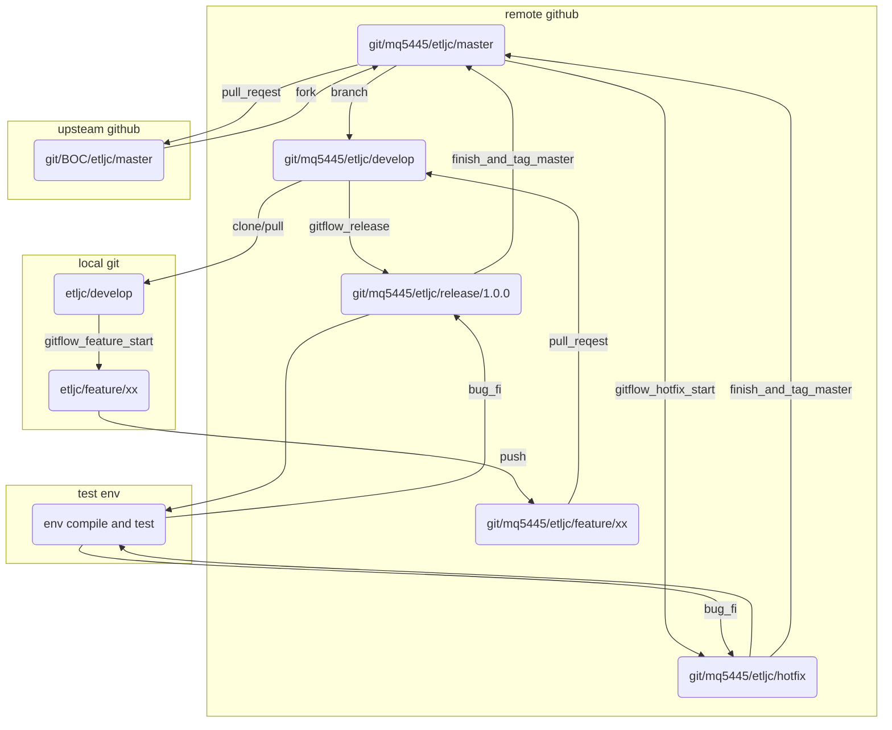

# git

[toc]


## 特点概述

* 分散型版本管理
*  
* markdown 
* 标准化编程 与 社会化编程


## git mermaid




## git 中文异常

https://blog.csdn.net/jfsufeng/article/details/79219673


```shell
git config --global core.quotepath false

```


## 中文手册

https://www.php.cn/manual/view/35088.html


## 本地英文手册


[file:///D:/software/Git/mingw64/share/doc/git-doc/user-manual.html](file:///D:/software/Git/mingw64/share/doc/git-doc/user-manual.html)


## github图片不显示

199.232.68.133 raw.githubusercontent.com


## 清理历史

https://docs.github.com/en/github/authenticating-to-github/removing-sensitive-data-from-a-repository

```shell

```


## 配置多 ssh 密钥

参考文档

https://blog.csdn.net/qq_30227429/article/details/80229167


https://blog.csdn.net/weixin_33749242/article/details/89023331


生成一个新的密钥

```shell
ssh-keygen -t rsa -f ~/.ssh/id_rsa_gitlab1 -C "mq5445@mail.notes.bank-of-china.com"
```

在 .ssh 文件夹下新建 `config` 文件并编辑，另不同 Host 实际映射到同一 `HostName`，但密钥文件不同。Host 前缀可自定义，例子中`ieit`


妈的，被这个gitbash 坑了。

网上所有写  ~/.ssh/config 估计都不是windows ，至少不是 win gitbash下的吧。


* **可别信别人都有，我没有，那我就 vi 建一个吧**


搞了两个小时。一直显示连不上，各种调。

看了下 gitbash 里的ssh 配置到底在哪。 

```shell
$ ssh -vT  git@github.com
OpenSSH_8.0p1, OpenSSL 1.1.1c  28 May 2019
debug1: Reading configuration data /etc/ssh/ssh_config
debug1: Connecting to github.com [52.74.223.119] port 22.

```

在 /etc/ssh

看看正经的目录有啥

```shell
$ ll /etc/ssh/
total 572
-rw-r--r-- 1 miaoq 197609 577388  6月  8  2019 moduli
-rw-r--r-- 1 miaoq 197609   1556  6月  8  2019 ssh_config
-rw-r--r-- 1 miaoq 197609   3122  6月  8  2019 sshd_config

```


ssh_config 是个客户端配置

sshd_config 是个服务器配置


```shell
vi ~/.ssh/config
```

```shell
# github user
Host git@github.com
Hostname https://github.com/
User bulbcat
IdentityFile ~/.ssh/id_rsa

#gitlab user
Host gitlab
Hostname http://22.11.38.153
User mq5445
IdentityFile ~/.ssh/id_rsa_gitlab1

```


