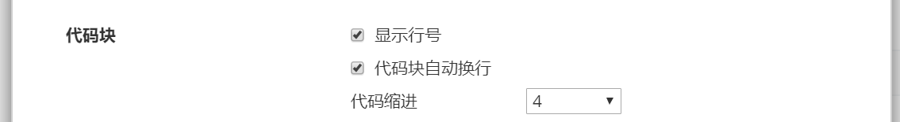
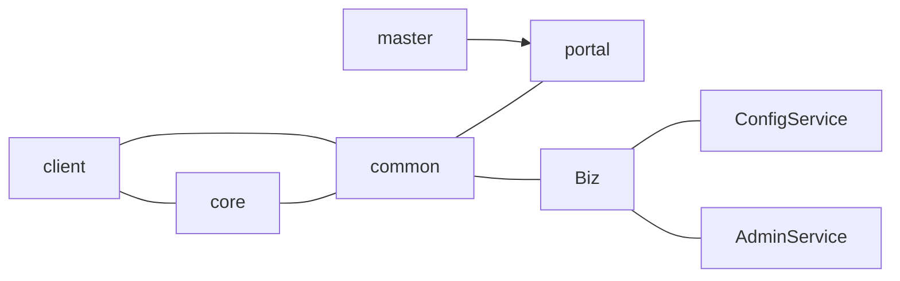
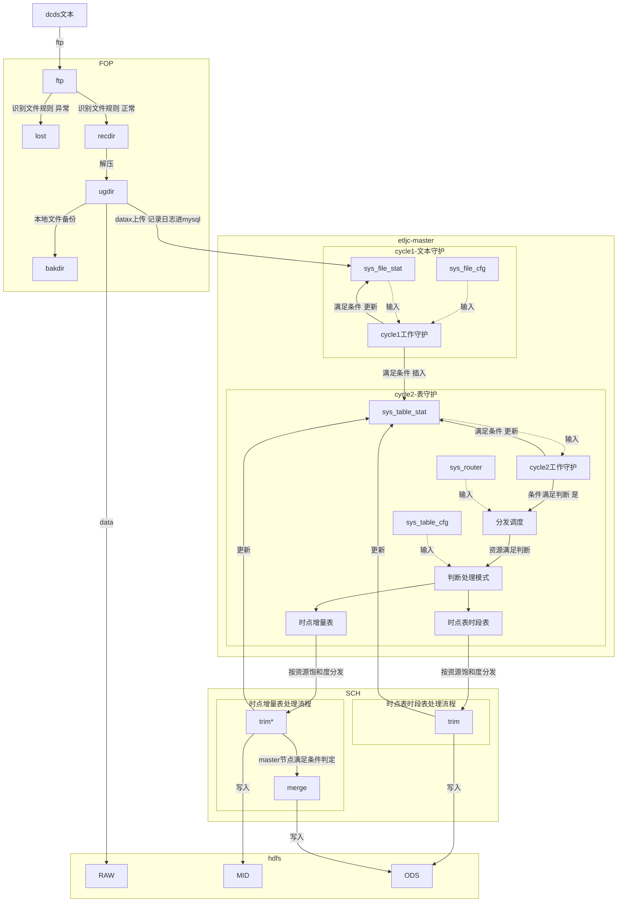

# Typora 配置


## 改了css 样式

*  搞了下 一级标题 不加序号

*  目录的字体颜色 保持同步

```po
C:\Users\miaoq\AppData\Roaming\Typora\themes
```


## 加了preference,显示代码行数




## md画图


```flow
st=>start: Start
st2=>start: start2
in1=>inputoutput: input1
in2=>inputoutput: input2
op=>operation: Your Opera
op2=>operation: xxxx
cond=>condition: Yes or No?
e=>end


st->in1->op->cond
st2->in2->op
cond(yes)->e
cond(no)->op


```




### 试着画etljc





## 图片设置相对路径


相对路径后，再分享模式会容易很多。直接扔对应的文件夹就可以用了。

git 上也可以直接引用。

目前设置在了 ./.assets

利用 . 使目录变为隐藏目录，typora文件树中不会显示，更方便的阅读条目。

如下图


git clean -f


